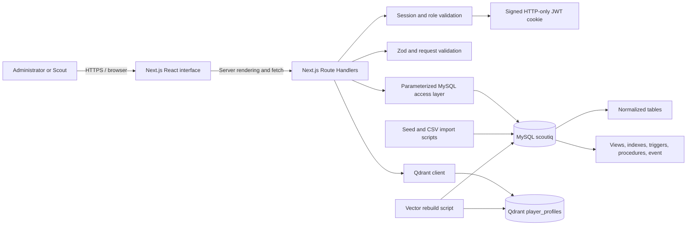

# System Architecture

## Component view

## Request lifecycle

1. The browser requests a page or API operation.
2. Protected routes read and verify the signed session cookie.
3. Role-sensitive operations check for `ADMIN`, `SCOUT`, or either role.
4. The server validates route parameters and request bodies.
5. SQL values are sent using parameter placeholders through the MySQL pool.
6. MySQL checks types, foreign keys, unique/check constraints, and triggers.
7. Multi-step transfer and recommendation workflows execute stored procedures.
8. Similarity requests retrieve a target vector and its nearest neighbors from Qdrant.
9. The API returns JSON or a server-rendered page displays the result.

## Data ownership

| Data | Authoritative system | Reason |
| --- | --- | --- |
| Users and roles | MySQL | Relational integrity and authentication lookup |
| Player identity and club data | MySQL | Structured source of truth |
| Statistics and recruitment history | MySQL | Transactional and queryable history |
| Reports and shortlists | MySQL | User ownership and constraints |
| Similarity vectors | Qdrant | Efficient nearest-neighbor retrieval |

Qdrant data is derived from MySQL and may be deleted and rebuilt without losing
authoritative football records.

## Main source modules

| Module | Responsibility |
| --- | --- |
| `src/app/(app)` | Authenticated pages and UI components |
| `src/app/api` | HTTP API boundary |
| `src/lib/db.ts` | MySQL pool, query helper, transaction helper |
| `src/lib/auth.ts` | Password hashing and JWT signing/verification |
| `src/lib/session.ts` | Cookie and role-aware session access |
| `src/lib/dashboard.ts` | Dashboard aggregation queries |
| `src/lib/similarity.ts` | Per-90 features and z-score normalization |
| `src/lib/qdrant.ts` | Qdrant connection and collection configuration |
| `src/db/migrations` | Canonical executable relational schema |
| `src/scripts` | Migration, seed, import, and vector rebuild utilities |

## Deployment assumptions

The submitted project is designed for local demonstration. The Next.js server,
MySQL server, and Qdrant server run as separate processes. Environment variables
connect the application to both databases. Production reverse proxies,
monitoring, backups, and high availability are outside the academic scope.
