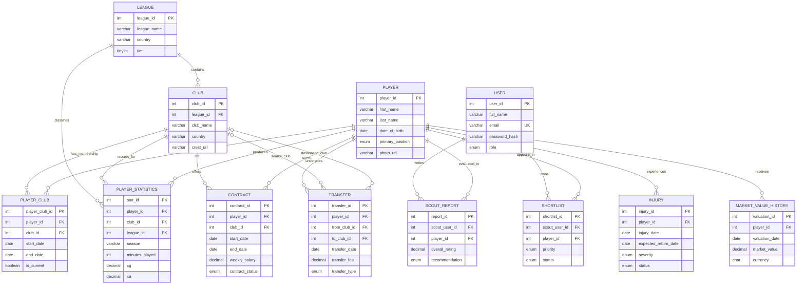

# Entity-Relationship Diagram

The diagram represents the physical MySQL tables created by
`src/db/migrations`. Derived views and the Qdrant collection are shown
separately because they are not independent relational entities.

## Derived database objects

- `schema_migrations` records applied migration filenames.
- `vw_latest_market_values` returns the latest valuation per player.
- `vw_available_players` excludes active or recovering injuries.
- `vw_contract_expiry` returns current, non-expired active contracts.
- `vw_u23_recruitment_candidates` combines age, value, contract, and availability.
- `vw_player_recruitment_snapshot` combines the principal recruitment fields.
- Qdrant collection `player_profiles` stores a vector keyed by `player_id`.

The Qdrant `player_id` is an application-level reference to `PLAYER.player_id`;
it is not a MySQL foreign key because it exists in a different database system.
